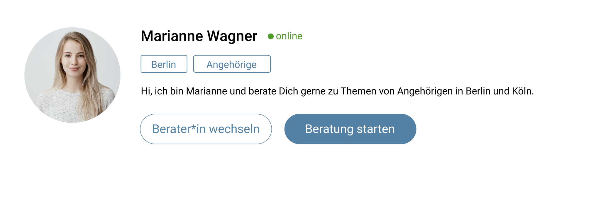

# Anweisungen

Die Anwendung besteht aus zwei Views:

1.) Beraterliste:

In der Datei mockdata.js befindet sich eine Array aus Usern (Beratern).

Alle Berater der Array, deren "active"-Key true ist, sollen hier in einer Liste dargestellt werden. Dabei sollen "profile_picture" als runder Avatar, "username" als Überschrift, "beratungsfelder" als ungeordnete Liste sowie die "beschreibung" des jeweiligen Beraters ausgewiesen werden.

Das folgende Desgin soll bei der Erstellung der Komponenten umgesetzt werden:

Unter jedem Berater in der Liste befindet sich ein Button ("Berater\*in auswählen"). Ein Klick auf diesen Button öffnet das Profil des Beraters und führt zum zweiten View:

2.) Profil des ausgewählten Beraters:

Hier wird nur der Berater, der ausgewählt wurde dargestellt mit einem größeren Avatar. Dabei soll auch sein Onlinestatus ("online_status") ausgewiesen werden (Schriftfarbe grün für online und rot für offline). Ein Klick auf den Button "Berater\*in wechseln" führt zurück zur Beraterliste. Der Button "Beratung starten" hat keine Funktion.

Designvorlage:

Bonus:

1.) Suche:
Erstelle einen Input über der Beraterliste, mit dem man nach dem username des Beraters suchen kann. Beispiel: Eingabe von "Ma" führt dazu, dass nur die Berater "Max Mustermann" und "Marianne Wagner" dargestellt werden.

2.) Routing:
Erstelle jeweils eine Route für die Beraterliste ("/beraterliste") und das Profil des Beraters, bei dem die Id des Beraters als param verwendet wird ("berater/{id}").
